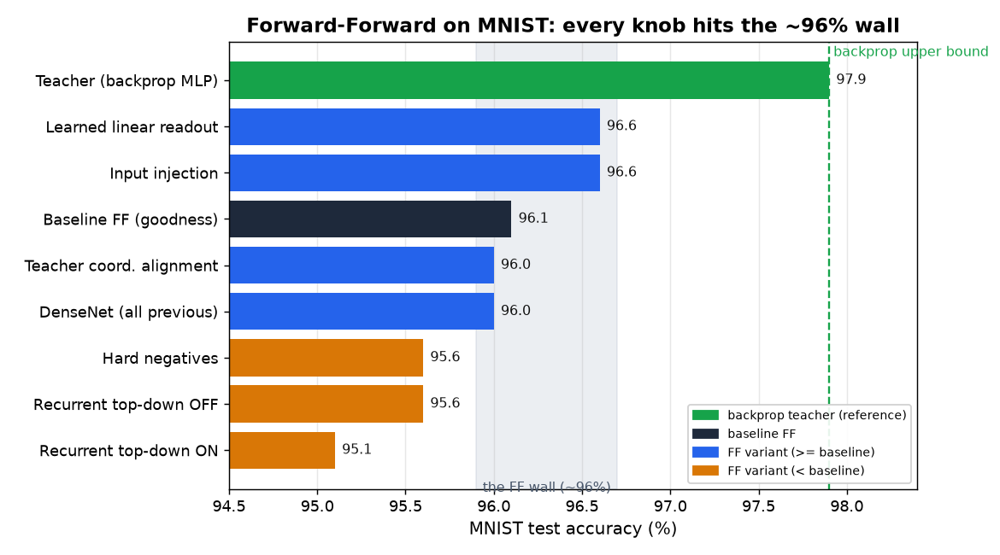
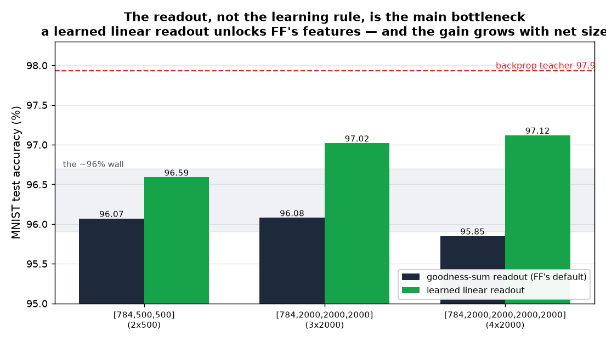
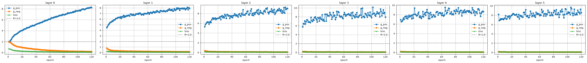

# Forward-Forward on MNIST — What Actually Moves the Needle?

A hands-on study of Hinton's **Forward-Forward (FF)** algorithm ([arXiv:2212.13345](https://arxiv.org/abs/2212.13345)).

Rather than chasing one accuracy number, this is a **controlled-variable investigation**: implement every variant, train each
under the *same budget*, and answer one question — **where is FF's accuracy ceiling, how big is it, and why?**

Full runnable code: [`ff_mnist_study.ipynb`](ff_mnist_study.ipynb). Reference: [mpezeshki/pytorch_forward_forward](https://github.com/mpezeshki/pytorch_forward_forward).

## The one-line answer

> **The ~96% wall is largely a *readout* limitation, not the FF learning rule.** With FF's default goodness-sum classifier,
> every architecture / connectivity / negative-data trick converges on ~96%. But swap in a **learned linear readout on a big
> net** and FF reaches **~97.1%** — within ~1 pp of the backprop teacher. FF's features at scale are strong; the crude readout
> was hiding it. The residual ~0.8 pp (feature quality) is the real, small price of backprop-free local learning, and it shrinks
> with scale.

---

## Setup (shared across all variants)

- **Task:** MNIST, `[784, 500, 500]` (two hidden layers of 500), **120 epochs/layer**, Adam, batch 1024.
- **Label encoding:** overlaid into the first 10 pixels — FF judges *"does this image match this label?"*
- **Positive** = image + true label. **Negative** = image + wrong label.
- **Goodness** = mean of squared activations; each layer trained locally (softplus contrast), no gradient across layers.
- **Classification (default):** try all 10 labels, pick the highest summed goodness.

## Results

| # | Variant | Test acc | Verdict |
|---|---|---:|---|
| — | Teacher: backprop MLP (upper bound) | **97.9%** | reference |
| 1 | **Baseline FF** (goodness readout) | 96.1% | the wall sits here |
| 2 | Input injection (concat input to every layer) | 96.6% | speeds convergence, no higher ceiling |
| 3 | DenseNet (concat all previous layers) | 96.0% | forward connectivity maxed out |
| 4a | Recurrent **top-down ON** | 95.1% | — |
| 4b | Recurrent **top-down OFF** (ablation) | 95.6% | **top-down contributes ~0** |
| 5 | Teacher coordination alignment | 96.0% | injected coordination doesn't lift ceiling |
| 6 | Hard negatives (teacher-picked) | 95.6% | **worse** — coverage collapse |
| 7 | Learned **linear readout** head | 96.6% (small) / **97.1% (big net)** | **breaks the wall — readout was the bottleneck** |

*(single seed; run-to-run swing ≈ ±0.3 pp, so anything inside the shaded band is statistically the same)*

---

## The experiments, one by one

**1. Baseline FF.** Plain FF, goodness readout. **91.98% @ 20 epochs → 96.12% @ 120 epochs.** Training budget — not architecture —
is the single biggest lever, but it too tops out at ~96%.

**2. Input injection** (ResNet-style: concat the original input to every layer). +0.5 pp *at 20 epochs*, but at full training it
matches the baseline. Ablation showed the useful part is the **image**, not the re-fed label (label-only injection *hurts*).
Verdict: **faster convergence, not a higher ceiling.**

**3. DenseNet** (each layer sees all previous layers' outputs). Deep layers stop stalling and their goodness climbs, but test
accuracy stays in the same ~94–96% blob. Forward connectivity is exhausted.

**4. Recurrent top-down** (settle over T timesteps; each layer reads bottom-up + top-down from the previous tick). The
`top-down ON vs OFF` ablation is the punchline: **removing top-down changes nothing** — the small gain over baseline was just the
recurrent scaffold doing ~6× more weight updates.

**5. Teacher coordination alignment.** Train a backprop teacher (globally coordinated features), then add a *local* loss pulling
each FF layer toward the teacher's matching layer — injecting the inter-layer coordination FF lacks, without global backprop.
It **accelerates convergence but converges to the same ~96%** ceiling.

**6. Hard negatives.** Use the teacher to pick each image's *most-confusable* wrong label as its negative. The negatives are
genuinely harder (g_neg stays higher), but accuracy **drops** — fixing one hard label per image undersamples the easy rejections
the model must also win at test time (**coverage collapse**).

**7. Learned linear readout.** Freeze the FF features, replace the goodness-sum classifier with a trained linear softmax head
(fed a neutral, label-free input). FF's *learning* is untouched — only the readout changes. On the small net it helps just
+0.5 pp, so it *looks* minor. But the gain **grows with net size**, because richer features are exactly what goodness-sum can't
exploit (and deep layers saturate, adding noise to the sum):

| FF net | goodness-sum | learned linear | readout gain |
|---|---:|---:|---:|
| `[784,500,500]` | 96.07% | 96.59% | +0.52 |
| `[784,2000,2000,2000]` | 96.08% | 97.02% | +0.94 |
| `[784,2000,2000,2000,2000]` | 95.85% | **97.12%** | **+1.27** |

At `2000×4` the learned readout reaches **97.1%** — the first FF number in this study to break the ~96% wall, within ~0.8 pp of
backprop. So the goodness-sum readout, not the FF features, was the main thing holding it back.

### Aside — why stacking more layers doesn't help: deep layers saturate

*A 6-hidden-layer FF. Blue = `g_pos`, orange = `g_neg`, θ = 2.0. Layers 0–1 learn smoothly; layers 2–5 get noisy.*

By layer 2 the objective is **already solved**: negatives are crushed toward 0 and positives sit far above the threshold, so
the softplus loss ≈ 0 and almost no gradient remains. Adam then amplifies the tiny, noisy gradients, and the deeper layers just
**wander and inflate their goodness** — that's the jitter in the plot. It is *benign* (nothing diverges), but it means the extra
layers aren't learning new discrimination; they've saturated. This is the mechanistic reason **depth doesn't lift FF's
accuracy** — and another face of law #3 below: those large, noisy deep-layer goodness values pour into the readout sum without
adding any useful signal (**goodness ↑ ≠ accuracy ↑**).

---

## Root cause: decomposing the FF → backprop gap (and how it changes with scale)

The gap `FF+goodness → FF+linear → teacher` splits into **readout** (goodness-sum vs a learned head) and **feature quality**
(FF features vs backprop features). The split **flips with net size**:

| FF net | goodness | linear | teacher | readout share | feature share |
|---|---:|---:|---:|---:|---:|
| `[784,500,500]` (small) | 96.07 | 96.59 | 97.93 | ~28% | **~72%** |
| `[784,2000,2000,2000,2000]` (big) | 95.85 | 97.12 | 97.93 | **~61%** | ~39% |

- On the **small** net the residual gap is mostly feature quality — a naive first read that "FF's features are the wall."
- On the **big** net the split flips: the **readout dominates**, and FF's features come within **~0.8 pp** of backprop once a
  proper classifier is attached.

So the honest, scale-aware picture: the ~96% ceiling was largely the **goodness-sum readout**. FF's features at scale are
strong; the naive readout couldn't use them. The `~0.8 pp` residual is the genuine (and shrinking) price of local, backprop-free
learning.

## Every suspect, ruled in or out

| Suspect | Verdict |
|---|---|
| Architecture (width / depth / injection / DenseNet / top-down) | not it — all ~96% once fully trained |
| Training budget | the real lever, but caps at ~96% |
| Inter-layer coordination (top-down / teacher-align) | injecting it does not move the ceiling |
| Negative data (hard / mixed) | ~96% either way; hardest-only is worse |
| **Readout (goodness-sum vs learned linear)** | **the biggest recoverable factor; grows with scale, breaks ~96% on big nets** |
| FF learning rule (local goodness, no backprop) | a real but **small** residual (~0.8 pp on big nets), shrinking with scale |

---

## Four methodology laws (the real takeaway)

1. **An undertrained baseline makes every change look like a win** — fully train the baseline before comparing anything.
2. **Faster convergence ≠ higher ceiling** — injection/alignment led at 20 epochs, tied at 120.
3. **Higher goodness/separation ≠ higher accuracy** — training fit is not test generalization (a bigger net pushed training
   goodness to 10 with zero test gain).
4. **Difference < noise = no difference** — the same config re-ran 94.10 / 94.35; single-seed rankings are meaningless.

## How to actually beat ~96%

**First, just fix the readout:** a big FF net + a learned linear head already gets you to **~97.1%** with no change to how FF
learns. To close the last ~1 pp you'd need a different *recipe* — Hinton reaches ~98.6% with **mask-blended hybrid-image
negatives** (not random wrong labels) and **convolutional / local-receptive-field** layers. Copying his 4×2000 *shape* alone
does **not** reproduce his number (with the naive readout, depth even hurts).

## Reproduce

Run [`ff_mnist_study.ipynb`](ff_mnist_study.ipynb) top to bottom (set `EPOCHS = 20` for a quick smoke test; reported numbers use 120).
